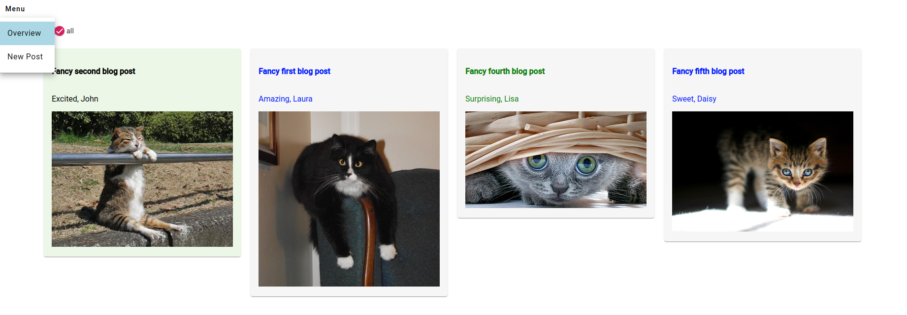
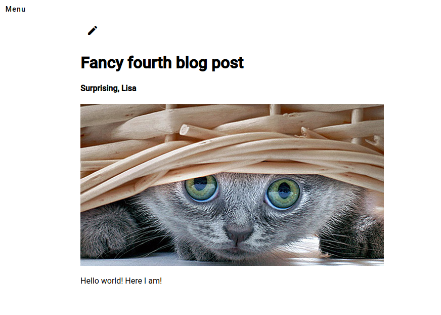
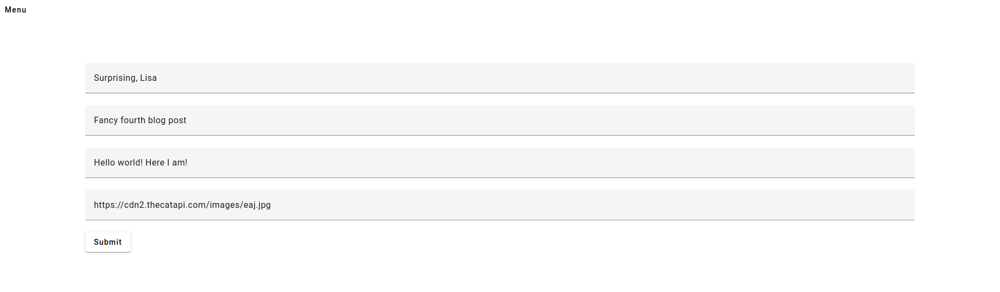

# 02 - Routing

In diesem Exercise gehen wir auf verschiedene Arten des Routings in Angular ein.

Als Beispielprojekt werden wir eine simple Blog-Seite erstellen, auf welcher eine Übersicht über die erstellten Blog Posts und eine Ansicht mit Detailinfos zu einzelnen Blog Posts verfügbar ist. Zudem werden wir eine Navigation erstellen, um das Routing zu üben und eine weitere Seite auf welcher über ein Formular neue Blog Posts erstellt werden können.

## Eine Voransicht des Endproduktes




## 2.1 Neue Routes erstellen

1. Erstelle eine neue Route `/overview` über welche die in der vorherigen Übung erstellte "overview" Komponente erreicht werden kann
2. Erstelle eine `wildcard` Route, welche alle weiteren URL Pfade auf die zuvor erstellte Route weiterleitet

## 2.2 Router-Outlet und Routerlink nutzen

1. Erstelle 2 neue Komponenten
   - eine mit Namen "navbar", welche eine Navigation bar werden soll
   - eine mit Namen "detail", welche als Detail Ansicht der Blog Posts
2. Integriere folgendes im App Template (HTML) file
   - die Navbar Komponente
   - einen `<main>` Tag
   - den `<router-outlet>` Tag
3. Der direkte Aufruf der "overview" Komponente in der App Komponente kann nun entfernt werden, da dieser dynamisch über den `router-outlet` Tag aufgerufen wird.
4. Importiere das Menu und Button von Angular Material [`mat-menu`](https://v7.material.angular.io/components/menu/overview) und `mat-button` und erstelle in der "navbar" Komponente ein Menu mit 2 Einträgen
   - der erste Eintrag "Overview" soll bei klick über einen `RouterLink` auf die bereits existierende "overview" Komponente navigieren
   - der zweite Eintrag "New Post" dient vorerst als Placeholder und wird in einer späteren Übung verwendet

## 2.3 Routing in der Komponente mit URL Parameter

1. Importiere den Router im `.ts` File der "overview" Komponente
2. Erstelle eine Methode `navigateToDetail` welche eine number ID entgegennimmt und auf über die URL `/detail/:id` mit der entsprechenden ID auf die "Detail" Komponente navigiert, wobei die ID aus dem Input verwendet werden soll.
3. Erstelle die neue Route und rufe über diese die "detail" Komponente auf. Die "detail" Komponente werden wir in kommenden Übungen weiter ausbauen.
4. Erstelle in der "overview" Komponente einen Button, welcher die oben genannte Methode mit der ID=1 aufruft.

### Zusatzaufgabe

Nutze `RouterLinkActive`, um den aktiven RouterLink einzufärben/hervorzuheben, indem die css-Klasse `active` zugewiesen wird. Als css-Klasse kann das untenstehende Snippet verwendet und beliebig angepasst werden.

```css
.active {
  background-color: lightblue;
}
```
